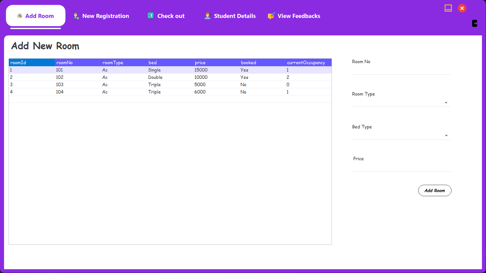
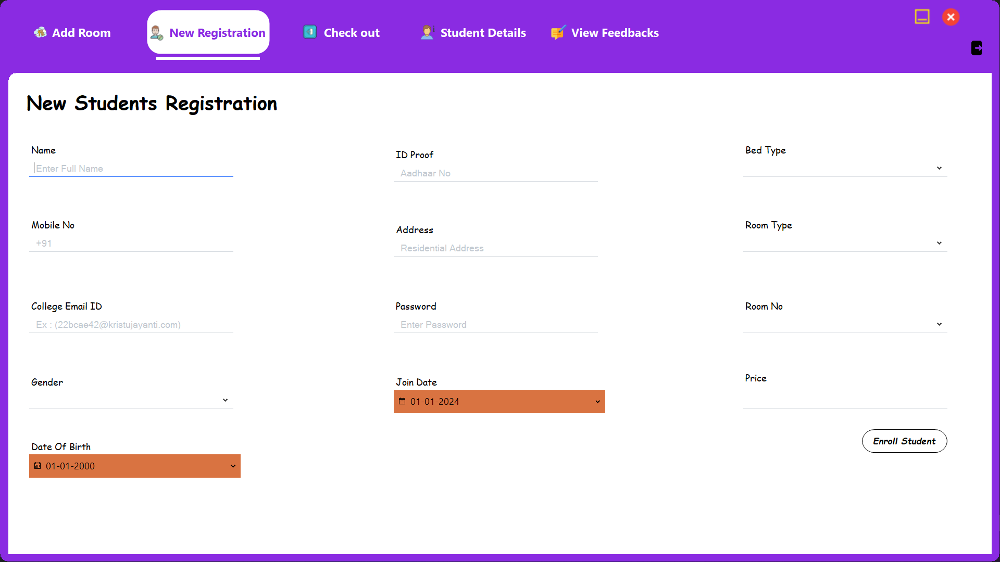
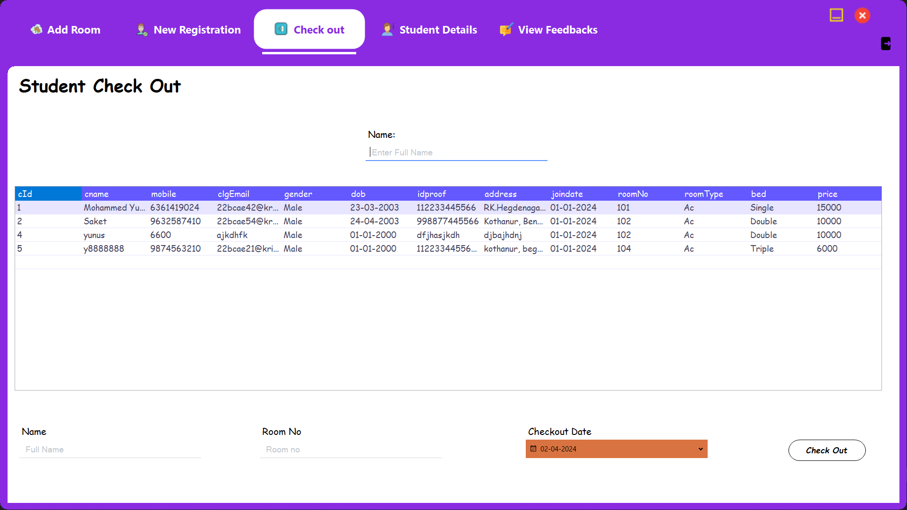
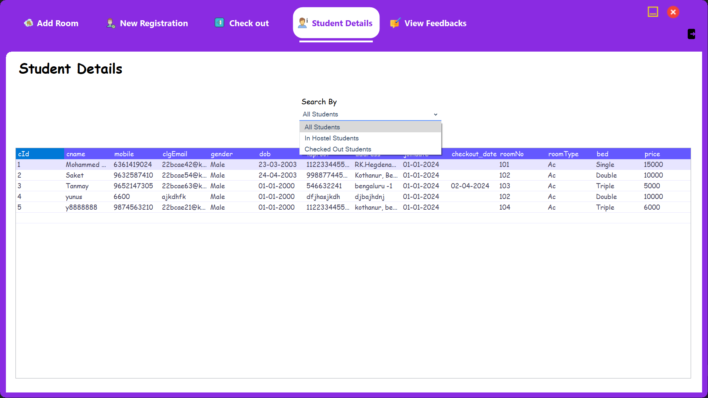
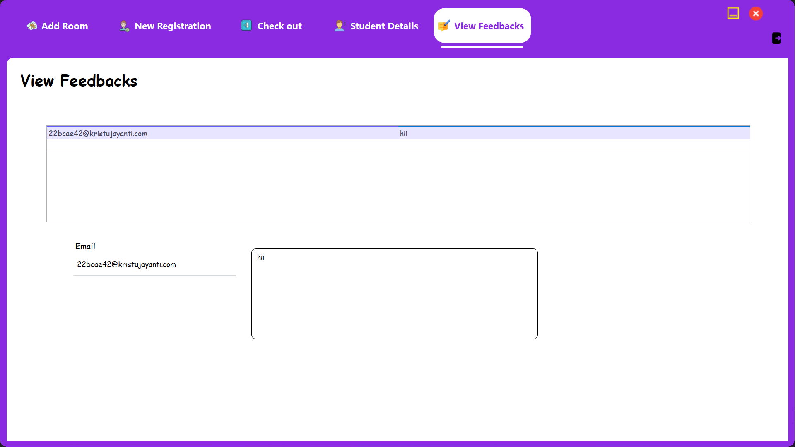
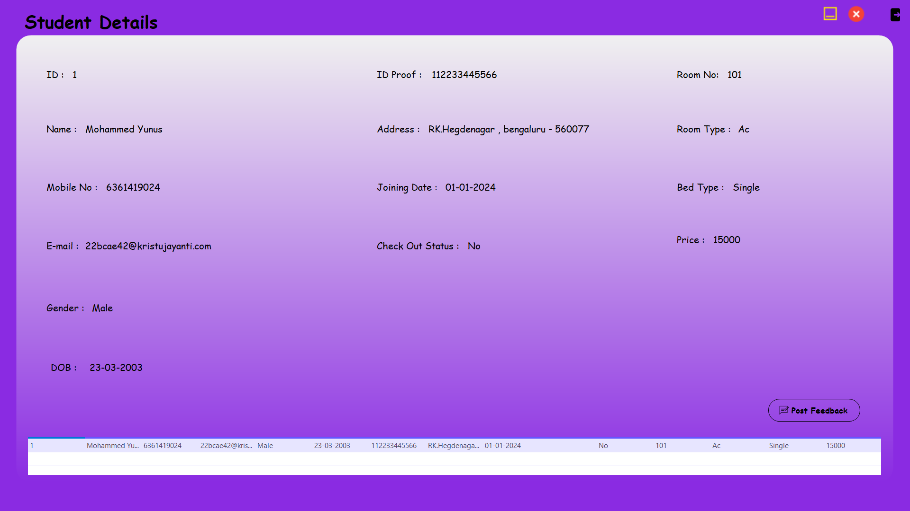
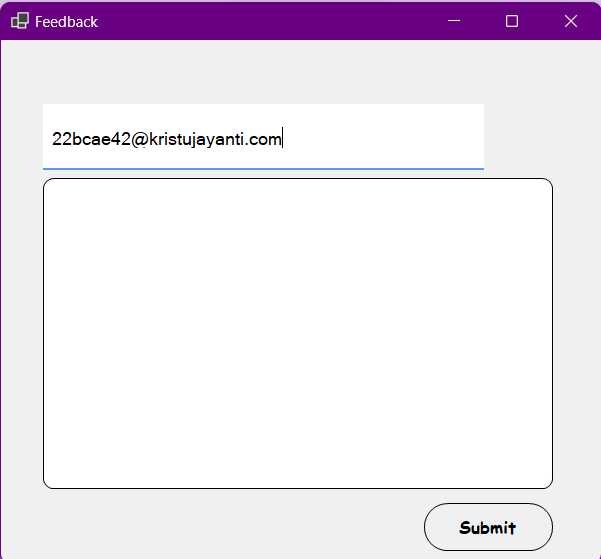

# Hostel Management System

A complete Desktop Application for managing hostel operations, developed using **Visual Basic .NET** and **MS SQL Server**.  
This project streamlines student registration, room allocation, employee management, and more in a user-friendly interface.

---

## Table of Contents

- [Features](#features)
- [Screenshots](#screenshots)
- [Project Structure](#project-structure)
- [Getting Started](#getting-started)
- [Contributing](#contributing)
- [License](#license)

---

## Features

- Student registration and management
- Room allocation and vacancy tracking
- User authentication with password recovery
- Dashboard with real-time statistics
- Feedback and complaint submission
- Attractive and modern icon-based interface

---

## Screenshots

### login


### Admin Dashboard










### Student Dashboard





---

## Project Structure

```
Hostel-Management-System/
│
├── Hostel Management/         # Main application source code (VB.NET)
│   ├── All UserControls/      # UI components
│   ├── My Project/            # App settings and resources
│   └── ...                    # Forms and logic files
│
├── HostelDatabase/            # SQL Server database scripts and project files
│
├── Icons/                     # Custom icons for the UI
│
├── assets/                    # Screenshots and images for documentation
│
├── .gitignore                 # Files and folders to ignore in Git
├── README.md                  # This file
```

---

## Getting Started

### Prerequisites

- Visual Studio 2019 or later (**with VB.NET support**)
- MS SQL Server 2016 or later

### Setup Instructions

1. **Clone the repository:**
   ```sh
   git clone https://github.com/Yunus4600/Hostel-Management-System.git
   ```

2. **Open the solution:**
   - Launch Visual Studio and open `Hostel Management/Hostel Management.sln`.

3. **Set up the database:**
   - Open `HostelDatabase/SQLQuery.sql` in SQL Server Management Studio.
   - Execute the script to create tables and seed data.

4. **Configure the connection string:**
   - Update the database connection string in the app configuration if necessary.

5. **Build and run the application.**

---

## Contributing

Contributions are welcome!  
To contribute:
- Fork this repository
- Create a new branch for your feature or bugfix
- Commit your changes with clear messages
- Open a pull request

---

## License

This project is licensed under the [MIT License](LICENSE).

---

**Project by [Yunus4600](https://github.com/Yunus4600)**
